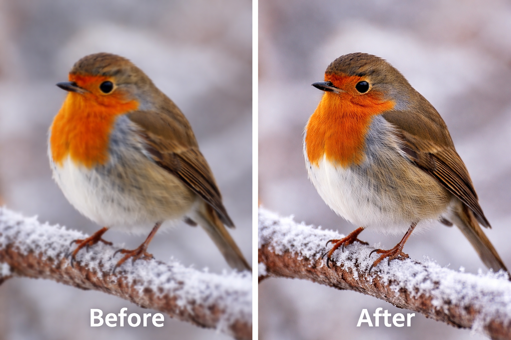

# 🌟 PixelForge AI



Welcome to **PixelForge AI**, your go-to image enhancement application powered by **ESRGAN** (Enhanced Super-Resolution Generative Adversarial Networks). Built with Python and featuring a sleek web interface, PixelForge AI brings cutting-edge image quality improvement right to your fingertips!

## ✨ Features

- 🖼️ **Stunning Image Enhancement:** Achieve high-quality image upscaling using the advanced ESRGAN model.
- 🔧 **Modular Architecture:** Seamlessly integrates multiple Python libraries for optimal performance:
  - 🖥️ `cv2` for advanced image processing.
  - 🔢 `numpy` for efficient numerical operations.
  - ⚙️ `torch` for deep learning and model implementation.
  - 🌐 `flask` for connecting the frontend and backend.
- 💻 **Modern Web Interface:** Enjoy a user-friendly experience with a clean design, built using HTML, CSS, and JavaScript.

## 🛠️ Technologies Used

- **Backend:** Python
  - 🔧 `torch`
  - 🖼️ `cv2`
  - 🔢 `numpy`
  - 🌐 `flask`
  
- **Frontend:** HTML, CSS, JavaScript

## 🚀 Installation and Setup

1. **Clone the repository:**
    ```bash
    git clone https://github.com/HimanshuBatra1615/PixelForge-AI.git
    ```

2. **Install required Python libraries:**
    ```bash
    pip install flask torch opencv-python numpy
    ```

3. **Run the application:**
    ```bash
    python app.py
    ```

4. **Access the app:** Open your browser and navigate to [http://127.0.0.1:5000/](http://127.0.0.1:5000/).

## 🎨 How to Use

1. **Upload an image** via the web interface.
2. **Enhance the image** with the power of ESRGAN.
3. **Download or view** your newly enhanced image.

## 📄 License

PixelForge AI is licensed under the **GNU General Public License (GPL)**. For more details, see the [LICENSE](LICENSE) file.

---

Elevate your images with PixelForge AI and experience the future of image enhancement today!
